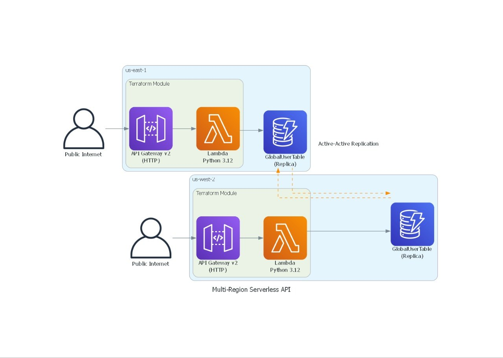

# Global-Flow-Architecture

Terraform-based infrastructure for the Global Flow Architecture project.

## Architecture Reference

Use the diagram below as the visual reference for this deployment:

## Git Hygiene for Terraform

Commit these files:

- `*.tf` infrastructure code
- `.terraform.lock.hcl` provider lock file
- `README.md` and other project documentation

Do not commit these files:

- Terraform state and backups (`*.tfstate`, `*.tfstate.*`)
- Terraform working directory (`.terraform/`)
- Sensitive variable files (`*.tfvars`, `*.auto.tfvars`, and JSON variants)
- Local credential/config files (`.terraformrc`, `terraform.rc`)
- Generated artifacts like `modules/serverless_api/lambda_function_payload.zip`

The repository-level `.gitignore` enforces these rules.
